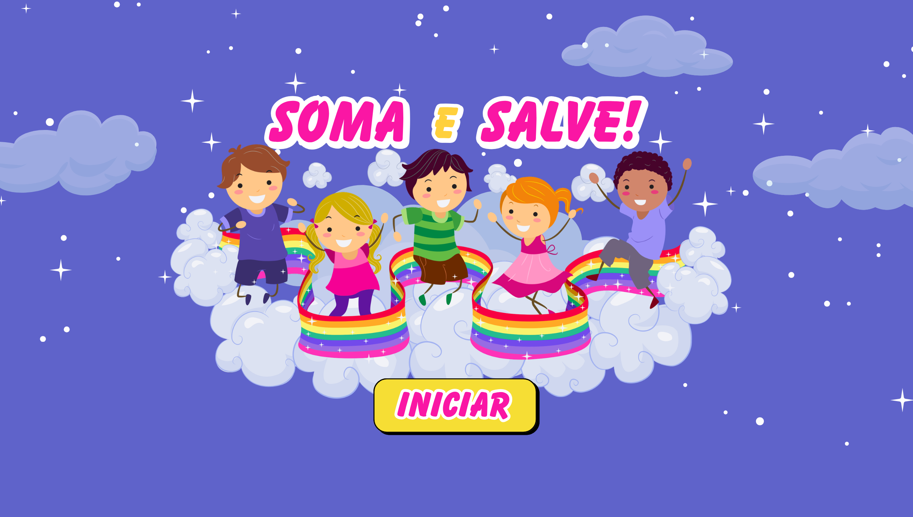

 

 

*Aplicativo educativo mobile que une matemática e histórias lúdicas*  
*para crianças de 6 a 10 anos.*

---

## Sobre o Projeto

**Soma e Salve!** é um jogo educativo desenvolvido como **APS (Atividade Prática Supervisionada)** do 1º semestre do curso de Ciências da Computação - UNIESI.

A proposta é tornar o aprendizado de matemática divertido e contextualizado: a criança resolve operações de soma para avançar em histórias lúdicas, salvando personagens e superando desafios.

---

## Demonstração

*Clique para assistir no YouTube*

---

## Funcionalidades

| Funcionalidade | |
|---|---|
| Operações de soma | com feedback visual imediato |
| 3 histórias temáticas | com narrativa progressiva |
| Sistema de acerto e erro | com animações de vitória e derrota |
| Design ilustrado | feito especialmente para o público infantil |
| Sonoplastia | integrada às histórias |
| Narração | gravada e editada no CapCut |

---

## As Histórias

**Princesa e o Ogro**  
O ogro está chegando e a princesa precisa de ajuda! Resolva as operações para mandá-lo embora e salvá-la.

**Corrida de Motos**  
Dois pilotos na largada! Responda certo para o moto azul vencer a corrida e voltar para casa.

**Ajude o Vampiro se Livrar dos Vagalumes**  
O vampiro está em perigo — vagalumes estão caçando o vampiro pelo castelo! Resolva as somas para salvá-lo antes que a luz o alcance.

---

## Screenshots

<table>
  <tr>
    <td align="center">Princesa — Início</td>
    <td align="center">Princesa — Vitória</td>
    <td align="center">Princesa — Derrota</td>
  </tr>
  <tr>
    <td></td>
    <td></td>
    <td></td>
  </tr>
  <tr>
    <td align="center">Corrida — Início</td>
    <td align="center">Corrida — Vitória</td>
    <td align="center">Corrida — Derrota</td>
  </tr>
  <tr>
    <td></td>
    <td></td>
    <td></td>
  </tr>
  <tr>
    <td align="center">Tela Inicial</td>
    <td align="center">Vampiro — Derrota</td>
    <td align="center">Vampiro — Vitória</td>
  </tr>
  <tr>
    <td></td>
    <td></td>
    <td></td>
  </tr>
</table>

---

## Tecnologias

| Tecnologia | Uso |
|---|---|
| **Kodular** | Plataforma de desenvolvimento (blocos visuais) |
| **MIT App Inventor** | Base da plataforma |
| **Android** | Plataforma alvo — futura atualização 2.0 |
| **CapCut** | Edição da narração |

---

## Download

> Para instalar o APK no Android, ative a opção **"Instalar de fontes desconhecidas"** nas configurações do seu dispositivo.

---

## Desenvolvedora

**Nadia Maria Kratky**

`Desenvolvimento Criativo` `PDM` `Sonoplastia` `Narração`

---

## Informações Acadêmicas

| Informações Acadêmicas ||
|---|---|
| Instituição | UNIESI |
| Curso | Ciências da Computação |
| Semestre | 1º semestre — 2024 |
| Disciplina | APS — Atividade Prática Supervisionada |
| Agradecimentos | Beatriz AP. Kratky · Professor João Paulo Barbosa |

---

*Este projeto foi desenvolvido para fins acadêmicos.*

